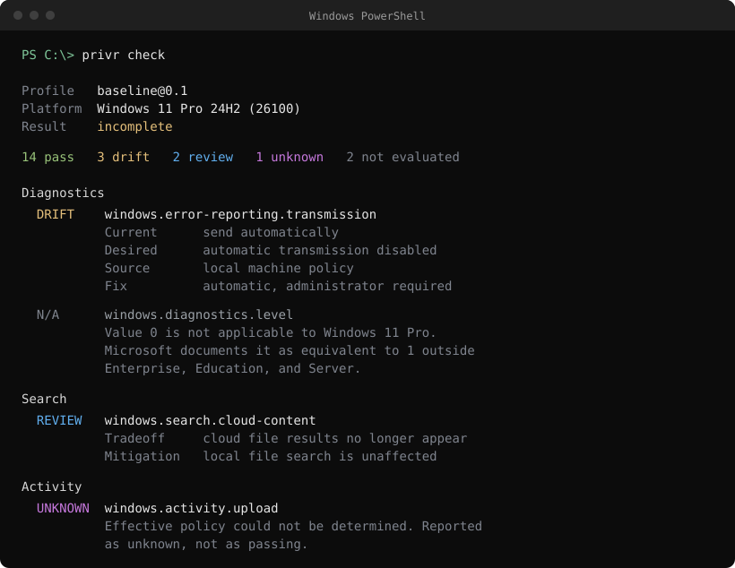
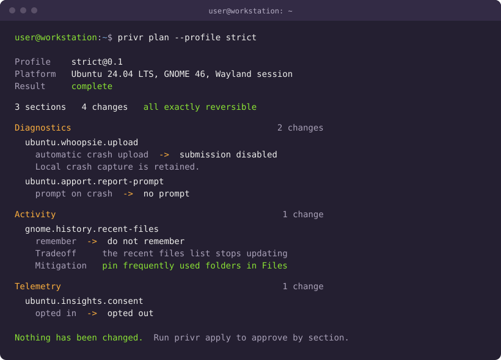

# privr

Privacy settings you can verify.

`privr` is a local-first privacy posture CLI. It reads which optional
data-sharing settings are actually in effect, explains the evidence and the
tradeoffs, applies a policy in reviewable steps, and can reverse what it
changed.

It is built for individuals and power users on machines they own: developers,
security-minded people, anyone running sensitive work or local models on their
own hardware. It is not a device-management product and does not compete with
one.

Every command produces stable text and versioned JSON, works offline, and is
designed to be driven by an agent harness as readily as by a person.

## Status

This repository is a researched concept with a compiling Rust skeleton. It does
not yet inspect or change any operating-system setting.

Every command returns exit code `3` and sets `complete: false`. That is
deliberate. Until real platform probes exist, the tool must never imply that a
machine passed.

What exists today is the design: the product and CLI contract, a Windows-first
control candidate matrix, macOS and Linux support boundaries, a typed and
allowlisted privilege architecture, exact rollback and drift semantics, and
cross-platform CI with dependency, MSRV, and coverage gates.

See [ROADMAP.md](ROADMAP.md) for what ships first, and
[docs/DECISIONS.md](docs/DECISIONS.md) for the decisions that constrain it.

## What it looks like

Both images below are mockups of the target output. **Nothing here is
implemented yet**, and neither image is a capture of a real machine.

`privr check` on Windows. Note the third result: a policy value that many tools
write and report as a success, which Microsoft documents as having no effect on
this edition.



`privr plan` on Linux. Changes are grouped into sections you approve one at a
time, every tradeoff is paired with a way to keep the capability, and a plan
never changes anything.



## Why this exists

Consider a setting that many Windows privacy tools change.

`AllowTelemetry = 0` is documented by Microsoft as applying only to Enterprise,
Education, and Server editions. On Home and Pro, Microsoft states that using it
is "equivalent to setting the value of 1"
([Policy CSP - System](https://learn.microsoft.com/windows/client-management/mdm/policy-csp-system)).

So on the most common editions of Windows the write succeeds, the value reads
back as `0`, every tool that checks it reports success, and the effective
behavior is unchanged. The machine audits as hardened and is not.

That is not an unusual case. Several widely applied policy values are silently
inert outside Enterprise and Education, and comparable traps exist on the other
platforms: a macOS preference read without the right permission can return a
value from a stale file rather than failing, and a Fedora setting written in the
main configuration file is overridden per repository.

`privr` exists to answer four questions without guessing:

1. What is this machine configured to share?
2. Which settings differ from the policy I selected?
3. What does each choice cost me in privacy, security, and functionality?
4. Can a change be applied and reversed without surprises?

The goal is not the longest list of tweaks. It is a smaller catalogue that is
cited, version-aware, and honest about what it does not know.

## Install

Building from source is currently the only path, and the binary does not yet do
anything useful. Rust 1.85 or later:

```bash
git clone https://github.com/blisspixel/privr
cd privr
cargo build --locked --release
```

One-line installers and package manager entries ship with the first signed
release. The installer will place an unprivileged binary and nothing else;
`privr` requests elevation only at apply time, after showing you the plan.

## Workflow

```text
check -> explain -> plan -> apply -> verify -> rollback
```

```text
privr check
privr explain windows.advertising.id
privr plan
privr apply
privr rollback <transaction-id>
```

- `check` reads effective state and compares it against a policy.
- `explain` shows evidence, applicability, management source, and tradeoffs.
- `plan` is read-only and shows the exact eligible change set.
- `apply` re-plans from fresh state, groups changes into sections, and asks for
  approval section by section. Stopping partway is a normal outcome, not a
  failure.
- `rollback` restores exact prior values, and only when current state still
  matches what was recorded.

The full command and exit-code contract is in [docs/CLI.md](docs/CLI.md).

## Agents

`privr` is designed to be driven by an agent harness from the first release,
whether that is a coding assistant, a hosted model, or a local one.

- Read-only tool access over stdio, so an agent can inspect and propose without
  being able to change anything.
- Mutating tools are absent from discovery unless explicitly enabled, and
  approval cannot be granted through a tool call.
- Result objects are self-contained and ordered deterministically, with
  verbosity tiers so a full report fits a small context window.
- Reports carry no stable machine identifier, so a report is safe to hand to a
  model.

`privr` never calls a language model itself. The model is always the caller,
never a dependency, and normal operation stays offline.

## Safety

- No product telemetry, and no network requirement for normal operation.
- No arbitrary shell commands in profiles or catalogue data.
- No mutation without a fresh plan and a check immediately before each write.
- No rollback that silently overwrites a later external change.
- No unknown, unreadable, or unsupported result reported as a pass.
- No clearing of logs, deleting of cloud data, disabling of updates, or removal
  of encryption as ordinary remediation.
- No promise of anonymity. Configuring a machine for minimal sharing does not
  make it unobserved, and on some platforms the configuration state itself is
  reported.

See [docs/SAFETY.md](docs/SAFETY.md) and
[docs/THREAT_MODEL.md](docs/THREAT_MODEL.md).

## Documentation

- [Design decisions](docs/DECISIONS.md)
- [Product definition](docs/PRODUCT.md)
- [CLI contract](docs/CLI.md)
- [Agent interface](docs/AGENT_INTERFACE.md)
- [Policy model](docs/POLICY.md)
- [Result and drift model](docs/RESULTS.md)
- [Control contribution standard](docs/CONTROL_STANDARD.md)
- [Platform findings](docs/PLATFORM_SUPPORT.md)
- [Architecture](docs/ARCHITECTURE.md)
- [Maintenance policy](docs/MAINTENANCE.md)
- [Safety model](docs/SAFETY.md)
- [Threat model](docs/THREAT_MODEL.md)
- [Privacy behavior](docs/PRIVACY.md)
- [Testing strategy](docs/TESTING.md)
- [Supply-chain security](docs/SUPPLY_CHAIN.md)
- [Research notes](docs/RESEARCH.md)
- [Contribution guide](CONTRIBUTING.md)

## Contributing

Early contributions should improve evidence and correctness: primary vendor
sources, compatibility findings, redacted fixtures, effective-state logic,
failure tests, and rollback tests. A setting does not become supported because
it appears in a tweak script.

Read [CONTRIBUTING.md](CONTRIBUTING.md) and [AGENTS.md](AGENTS.md) before making
changes.

## License

Apache-2.0. See [LICENSE](LICENSE).
