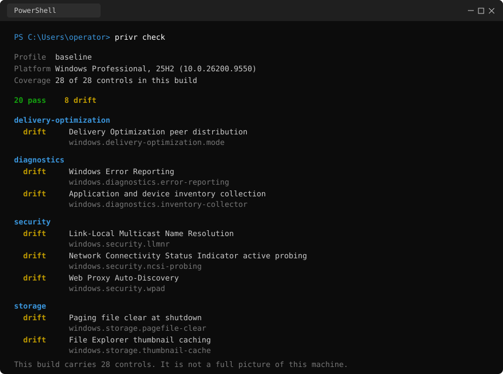
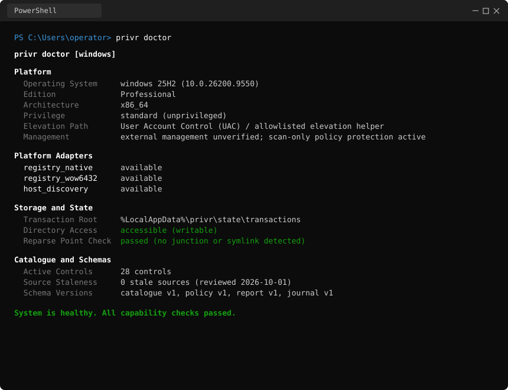
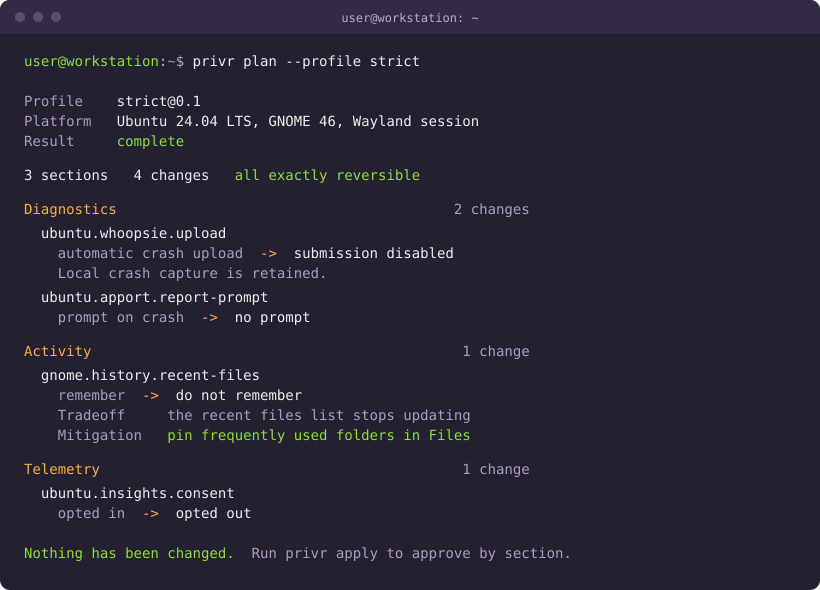
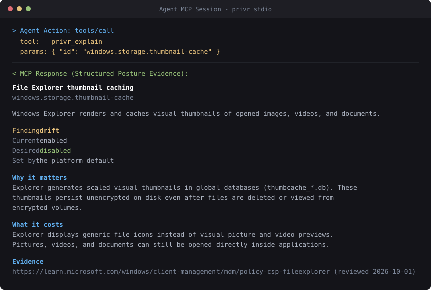

# privr

Privacy settings you can verify.

`privr` is a local-first privacy posture CLI. It reads which optional
data-sharing settings are actually in effect, explains the evidence and the
tradeoffs, applies a policy in reviewable steps, and can reverse what it
changed.

It is built for individuals and power users on machines they own: developers,
security-minded people, anyone running sensitive work or local models on their
own hardware. It is not a device-management product and does not compete with
one.

Every command produces stable text and versioned JSON, works offline, and is
designed to be driven by an agent harness as readily as by a person.

## Status

- **Windows `check`, `explain`, `list`, `doctor`, `recommend`, `simulate`, `plan`, `apply`, `history`, and `rollback` are implemented**, with posture dimensions, rollback journaling, interactive terminal action prompts (`[y] apply safe fixes, [d] preview diff, [e] explain score, [q] quit`), scoring model and critical controls walkthroughs, convenient CLI aliases (`status`, `scan`, `diff`, `fix`, `harden`, `undo`, `log`), and native UAC elevation handling. Release blockers remain in the roadmap.
- **Defensive and adaptive application**: `plan` and `apply` accept `--workload` (`general`, `developer`, `creative`, `mobile`, `high-assurance`) and `--max-friction`. When run unprivileged, batch operations apply eligible user-scope controls and report deferred machine-scope controls without failure.
- **Linux and macOS `check` are experimental** with typed elevation metadata, tested in CI across multiple platforms.
- **File-based probe replay has started** for Windows advertising ID and diagnostic data. Advertising policy distinguishes enforcement from user choice. Synthetic observations exercise the compiled probes and evaluator; native captures and full per-control coverage remain release blockers.
- **Agent integration (`privr mcp`) is implemented**, providing a stdio Model Context Protocol (MCP) server exposing `privr_check`, `privr_plan`, `privr_apply`, `privr_recommend`, `privr_simulate`, `privr_explain`, and `privr_doctor` with Agent Plugins v1.0.0 packaging.

The full state, including known defects, is in
[ROADMAP.md](ROADMAP.md#current-state).





On the machine this was developed on, one control found something real:

```text
diagnostics
  pass      Diagnostic data level
            windows.diagnostics.level
            A level of 0 is configured, but this Windows edition does not honor it.
            Microsoft documents value 0 as applying only to Enterprise, Education,
            and Server, and as equivalent to 1 elsewhere. This machine sends
            required diagnostic data.
```

Something had set `AllowTelemetry = 0` on a Windows Professional machine. A
checker that interprets only that configured value could report telemetry as
disabled. It is not. The `pass` above means the effective required-only level
matches the selected policy; it does not mean diagnostic transmission is off.

What is designed but not built: custom policy files, sectioned approval,
complete per-control fixtures, and signed releases. PowerShell session-only history
is planned, with [its scope and tradeoffs](docs/PRIVACY_RESIDUE.md#shell-command-histories)
documented; it is not checked or changed by `privr` today.
Cache and disposable-temp cleanup is [planned](docs/CACHE_PRIVACY_PLAN.md),
thorough by default, with `--polite` retaining disruptive caches. Both modes
protect OS operation, recovery, and active work; login state, history, and
persistent site data require separate selection and approval. Unconfirmed calls
preview the plan. Removal does not promise secure media erasure. `purge` is not
implemented.

## Where it is going

`plan` exists today only as a flat list. This is the intended shape: changes
grouped into sections you approve one at a time, every tradeoff paired with a
way to keep the capability, and a plan that changes nothing.



The image is a mockup of unimplemented behaviour, unlike the output above it.

Local retention matters too. Planned PowerShell support will recommend
session-only command history at baseline, keeping recall in the current shell
without saving new PSReadLine history across sessions. The plan will disclose
the loss of cross-session recall. Bounded retention and cleanup of existing
history need further research; security logs remain outside this setting.
Predictive suggestions are a separate option. See the
[roadmap](ROADMAP.md#powershell-session-only-history-planned).

## Why this exists

Consider a setting that many Windows privacy tools change.

`AllowTelemetry = 0` is documented by Microsoft as applying only to Enterprise,
Education, and Server editions. On Home and Pro, Microsoft states that using it
is "equivalent to setting the value of 1"
([Policy CSP - System](https://learn.microsoft.com/windows/client-management/mdm/policy-csp-system)).

So on the most common editions of Windows the write succeeds, the value reads
back as `0`, a checker can mistake that configured value for effective refusal,
and the diagnostic level remains required-only. The write alone does not prove
the claimed privacy effect.

That is not an unusual case. Several widely applied policy values are silently
inert outside Enterprise and Education, and comparable traps exist on the other
platforms: a macOS preference read without the right permission can return a
value from a stale file rather than failing, and a Fedora setting written in the
main configuration file is overridden per repository.

`privr` exists to answer four questions without guessing:

1. What is this machine configured to share?
2. Which settings differ from the policy I selected?
3. What does each choice cost me in privacy, security, and functionality?
4. Can a change be applied and reversed without surprises?

The goal is not the longest list of tweaks. It is a smaller catalogue that is
cited, version-aware, and honest about what it does not know.

## Install

Building from source is currently the only path. Rust 1.95 or later:

```bash
git clone https://github.com/blisspixel/privr
cd privr
cargo build --locked --release
```

One-line installers and package manager entries ship with the first signed
release. The installer will place an unprivileged binary and nothing else;
`privr` requests elevation only at apply time, after showing you the plan.

## Workflow

```text
check -> explain -> recommend -> simulate -> plan -> apply -> verify -> rollback
```

This is the canonical workflow. On Windows, all commands in the lifecycle are
implemented. Mutation remains experimental until the roadmap's release
requirements are met; see [Current state](ROADMAP.md#current-state) for testing
and validation limits:

```text
privr check (or privr scan, privr status)
privr explain windows.advertising.id
privr recommend --workload developer
privr simulate --profile baseline
privr plan (or privr diff)
privr apply (or privr fix)
privr history (or privr log)
privr undo (or privr rollback)
```

- `doctor` reports capability facts, elevation paths, platform adapters, storage integrity, and schema versions.
- `check` (aliases: `status`, `scan`, `audit`) reads effective state and compares it against a policy across five posture dimensions (behavioral-commercial, forensic-residue, network-exposure, diagnostic-crash, ambient-sensor).
- `explain` without arguments (or with `score`, `critical`, `posture`) walks through the posture calculation, five dimensions, four friction tiers, and critical controls; passing an exact ID shows technical evidence, applicability, management source, and tradeoffs.
- `recommend` computes deterministic change recommendations ordered by friction tier (Tier 0 transparent to Tier 3 incompatible/tradeoff), workload persona, or friction budget.
- `simulate` performs a dry-run counterfactual posture vector projection without mutating host state, reporting transition deltas, friction counts, and reboot or signout requirements.
- `plan` (alias: `diff`) is read-only and shows the exact eligible change set. Running `privr plan` without arguments defaults to the daily-driver general persona and cosmetic friction ceiling.
- `apply` (aliases: `fix`, `harden`) executes safe, verified remediation with transaction journaling, interactive plan review, and native in-place elevation (`-e, --elevate`). Running `privr apply` without arguments applies recommended daily-driver controls with zero workflow disruption.
- `history` (alias: `log`) lists previous transactions, timestamps, applied control counts, and profiles.
- `rollback` (aliases: `restore`, `undo`) restores exact prior values. Running `privr undo` without arguments automatically targets the most recent transaction recorded on disk.

The full command and exit-code contract is in [docs/CLI.md](docs/CLI.md).

## Agents
 
`privr` is designed to be driven by an agent harness from the first release,
whether that is a coding assistant, a hosted model, or a local one. A direct
stdio server is implemented at `privr mcp`, alongside packaging for the open
[Agent Plugins](https://agent-plugins.org/) standard (`plugin.json`, `mcp.json`,
and `skills/privr/SKILL.md`).

- Read-only tool access (`privr_status`, `privr_doctor`, `privr_catalog`,
  `privr_check`, `privr_explain`, `privr_plan`, `privr_recommend`, `privr_simulate`)
  over stdio, so an agent can inspect, simulate, and propose without being able
  to change anything.
- Mutating tools (`privr_apply`, `privr_rollback`) are absent from discovery
  unless explicitly enabled via `--allow-apply`, and approval cannot be granted
  through an unconfirmed tool call.
- Result objects are self-contained and ordered deterministically, with
  verbosity tiers so a full report fits a small context window.
- Reports carry no stable machine identifier, so a report is safe to hand to a
  model.



`privr` never calls a language model itself. The model is always the caller,

never a dependency, and normal operation stays offline.

## Safety

These are the release requirements. The experimental `apply` and `rollback` do
not yet meet all of them; see [ROADMAP.md](ROADMAP.md#current-state).

- No product telemetry, and no network requirement for normal operation.
- No arbitrary shell commands in profiles or catalogue data.
- No mutation without a fresh plan and a check immediately before each write.
- No rollback that silently overwrites a later external change.
- No unknown, unreadable, or unsupported result reported as a pass.
- No clearing of logs, deleting of cloud data, disabling of updates, or removal
  of encryption as ordinary remediation.
- No promise of anonymity. Configuring a machine for minimal sharing does not
  make it unobserved, and on some platforms the configuration state itself is
  reported.

See [docs/SAFETY.md](docs/SAFETY.md) and
[docs/THREAT_MODEL.md](docs/THREAT_MODEL.md).

## Documentation

- [Design decisions](docs/DECISIONS.md)
- [Product definition](docs/PRODUCT.md)
- [CLI contract](docs/CLI.md)
- [Agent interface](docs/AGENT_INTERFACE.md)
- [Policy model](docs/POLICY.md)
- [Result and drift model](docs/RESULTS.md)
- [Control contribution standard](docs/CONTROL_STANDARD.md)
- [Platform findings](docs/PLATFORM_SUPPORT.md)
- [Architecture](docs/ARCHITECTURE.md)
- [Maintenance policy](docs/MAINTENANCE.md)
- [Safety model](docs/SAFETY.md)
- [Threat model](docs/THREAT_MODEL.md)
- [Privacy behavior](docs/PRIVACY.md)
- [Privacy residue and erasure](docs/PRIVACY_RESIDUE.md)
- [Privacy cache capability plan](docs/CACHE_PRIVACY_PLAN.md)
- [Testing strategy](docs/TESTING.md)
- [Supply-chain security](docs/SUPPLY_CHAIN.md)
- [Research notes](docs/RESEARCH.md)
- [Contribution guide](CONTRIBUTING.md)

## Contributing

Early contributions should improve evidence and correctness: primary vendor
sources, compatibility findings, redacted fixtures, effective-state logic,
failure tests, and rollback tests. A setting does not become supported because
it appears in a tweak script.

Read [CONTRIBUTING.md](CONTRIBUTING.md) and [AGENTS.md](AGENTS.md) before making
changes.

## License

Apache-2.0. See [LICENSE](LICENSE).
